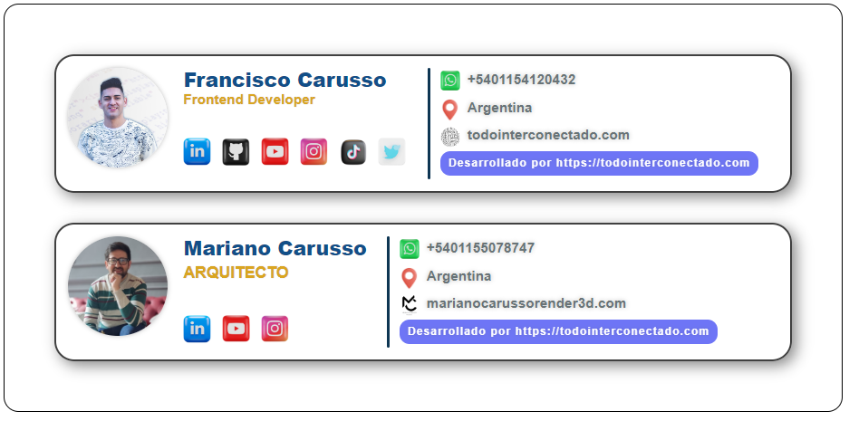
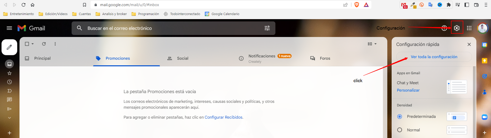
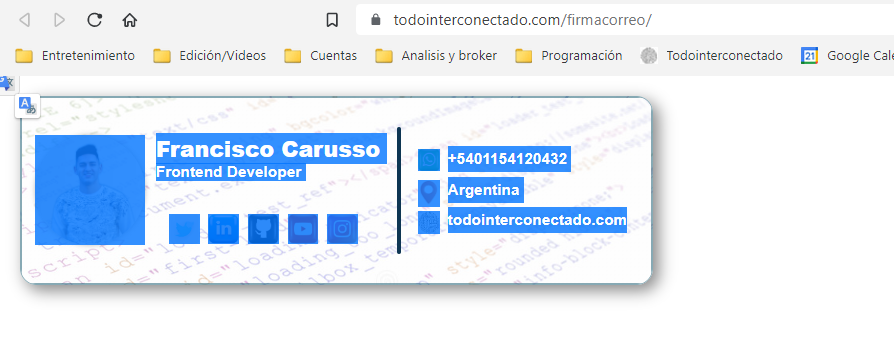
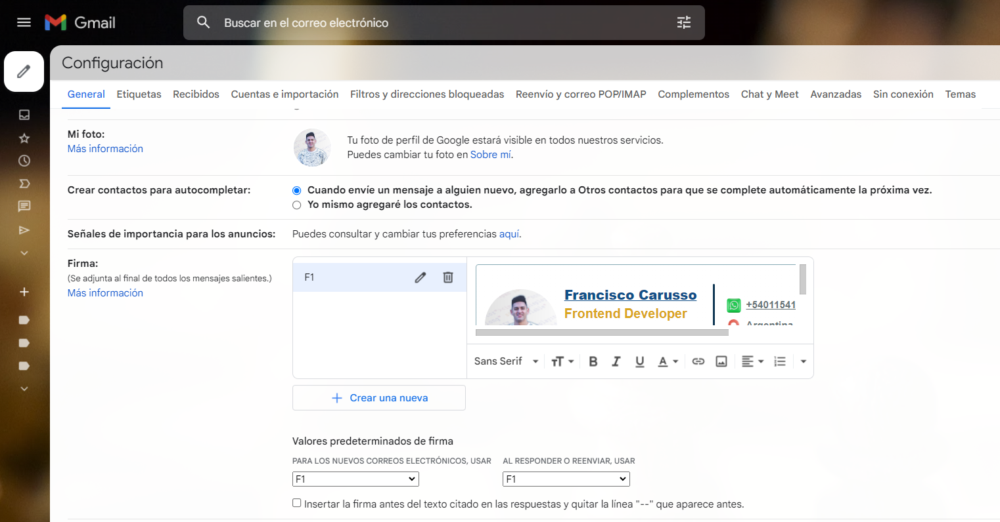

## Todointerconectado - Professional Email Signature Template

## Developed by Francisco Carusso! 💯

Thanks for checking out this front-end coding challenge.

Access the resolution of the challenge: [https://todointerconectado.com/firmacorreo/](https://todointerconectado.com/firmacorreo/)

## You can also visit my link at:

[https://www.linkedin.com/es/franciscocarusso/](https://www.linkedin.com/es/franciscocarusso/)

## Welcome! 👋

Thanks for checking out this front-end coding challenge.

Challenges help you improve your coding skills by creating realistic projects.

**To do this challenge, you need a basic understanding of HTML and CSS.**

## The challenge

Your challenge is to create this preview card component and make it look as close to the layout as possible.

You can use any tools you like to help you complete the challenge. So if you have something you'd like to practice, feel free to give it a try.

Your users should be able to:

- See the optimal layout based on your device's screen size
- View hover states for interactive elements

## Where to find everything

Your task is to build the project with the layouts inside the `/layout` folder. You will find a mobile and a desktop version of the design.

Designs are in static PNG format. Using PNG files will mean you'll need to use your best judgment for styles like 'font size', 'padding' and 'margin'.

You will find all the necessary resources in the `/img` folder. The assets are already optimized.

## Cargar la firma en el gmail

Paso 1: Abrir seción en la cuenta de gmail
Paso 2: Ir a configuración 
Paso 3: Creamos nombre de firma
Paso 4: Copiamos la estructura de la pagina y pagamos 
Paso 5: Pegamos 
Paso 6: Valores predeterminados de firma seleccionamos el nombre creado
Paso 6: Abajo de todo confirmamos el guardado.

